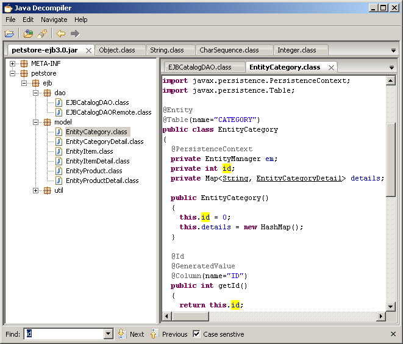

# Recovering Source from Java Classes

Lets say for some reason you don't use a VSC system like git and have no backups of your project source. You still have the releases you've published but the source has been lost, what do you do? 

Lets explore your options in increasingly difficult situations.

## Straight from javac

If you did `javac MyFile.java` and want to recover the original source from `MyFile.class` then you're in luck. Code generated from the standard Java compiler is quite simple 99% of the time. In most cases even decades old advice like _"Toss the class/jar in JD-GUI"_ will suffice.



JD-GUI is one of the oldest and most recognized Java decompilers. Its user interface is easy to understand and _"it just works"_.

## Straight from the kotlin compiler

Kotlin is a JVM language and a lot of it will look the exact same as if you compiled a Java application. But this is where JD-GUI starts to falter. Dropping in even simple Kotlin code generated uncompilable Java code. In more complex methods decompilation may fail all together.

Here's a simple field written in a Swing application: `var fileTree: JTree? = null`

Here's the decompiled Java:
```java
  @Nullable
  private static JTree fileTree;

  @Nullable
  public final JTree getFileTree() {
    return fileTree;
  }
  
  public final void setFileTree(@Nullable JTree <set-?>) {
    fileTree = <set-?>;
  }
```
The field definition is fine, so is the getter, but the setter is busted. Its not hard to fix manually, but problems like this add up and make it a bit of a hassle to clean up decompiled output. The problem here is that Kotlin us using `<set-?>` as a variable name and JD-GUI doesn't bother to check if variable names are legal or not.

Then there's the parts of Kotlin under the hood. Companion classes, calls to `kotlin.jvm.internal.*` classes like `Intrinsics`, `@Metadata` annotations, uneeded `@JvmStatic` annotations, internal Lambda classes, etc. These are things that if you wanted to get compilable Java source back would require a fair amount of manual work.

> But what about other Java decompilers?

Thankfully you have more than just JD-GUI available to you now. CFR, Procyon, and Fernflower are the most popular alternatives at the moment ([You can use all of them easily through Recaf](https://github.com/Col-E/Recaf)). They all will see `<set-?>` and rename the variable themselves in order to give you better output, and are generally more stable.

## Straight from the Groovy compiler

Groovy is worse off than Kotlin by a mile. The compiler-generated names of members and variables will make recovering compilable Java source code a difficult challenge.

Here's some some groovy code:
```java
 private boolean shouldTrustSSLCertsUsingTrustStore(HTTPRequest request) {
    return request.sslTrustStoreFile !=null || sslTrustStoreFile !=null
}
```
Spoiler: JD-GUI chokes and can't even decompile this simple boolean function. So what gives?

Lets take a look using CFR
```java
private boolean shouldTrustSSLCertsUsingTrustStore(HTTPRequest request) {
    Boolean bl;
    CallSite[] callSiteArray = HTTPClient.$getCallSiteArray();
    if (ScriptBytecodeAdapter.compareNotEqual((Object)callSiteArray[38].callGroovyObjectGetProperty((Object)request), null) || ScriptBytecodeAdapter.compareNotEqual((Object)this.sslTrustStoreFile, null)) {
        bl = Boolean.TRUE;
        return DefaultTypeTransformation.booleanUnbox((Object)((Boolean)ScriptBytecodeAdapter.castToType((Object)bl, (Class)HTTPClient.$get$$class$java$lang$Boolean())));
    }
    bl = Boolean.FALSE;
    return DefaultTypeTransformation.booleanUnbox((Object)((Boolean)ScriptBytecodeAdapter.castToType((Object)bl, (Class)HTTPClient.$get$$class$java$lang$Boolean())));
}
```
Oh... Oh god why.... And it doesn't stop there. There's _plenty_ of compiler generated code for this function in terms of all the crap it references. Recovering Groovy code is actually more effort than certain kinds of obfuscation.

## Obfuscation: Renaming

Speaking of which, lets take a look at some obfuscated code in a before/after setting.

Before:
```java
class DuplicateRemover {
    void remove(Collection<Object> collection) { ... }
}
// Usage
List<Object> list = MyRestAPI.get("url");
DuplicateRemover remover = new DuplicateRemover();
remover.remove(list);
displayList(list);
```
After:
```java
class a {
    void a(Collection a) { ... }
}
// Usage
List l = b.a("url");
a a = new a();
a.a(l);
d(l);
```
So we've lost our class and member names. Variables are renamed to single characters too. What do we do here? There are two main cases, both of which will require manual effort to use, but its not something difficult and may be worth your time depending on how valuable your code is to you. Tools like [Enigma](https://github.com/FabricMC/Enigma) and [Recaf](https://github.com/Col-E/Recaf) both let you rename classes/fields/methods. 

**Ideal case**: Its your code, so the shape of the code should look familiar. Start somewhere that you're familiar with and begin renaming. We could start with `class a` being renamed back to `class DuplicateRemover`. Then rename the method inside to `remove`. From there our usage code becomes more legible _(`DuplicateRemover a = new DuplicateRemover(); a.remove(l);`)_.

**Less ideal case**: Its not your code but its your job to figure it out. Start by looking for landmarks. If the application has a unique piece of text in it look for that text. In our case lets say we know our app connects to `"url"` but we know nothing else about the code. If we search for `"url"` we can find our usage of what should be our duplicate remover class. We can assume the `a("url")` call is some sort of `GET` request so we can rename that to `doGet`, the class is some web-api wrapper for our url so it can become `UrlApi`. Then we look at the remover usage and see what the method does. Classes belonging to the core JDK cannot be renamed so stuff like removing duplicates from a collection should be obvious at a glance. See the pattern? [Find a landmark, poke around, work backwards renaming along the way. Rinse and repeat](https://youtu.be/WB4mZ5f42Vg?t=357). 

In both of these cases once you start renaming things, the rest of the code becomes clear since more and more of the obfuscated code will contain references to your renamed logic. Starting out is the hardest part, but once you get going it becomes much easier. Put on some music and you'll be done in no time.

## Obfuscation: String encryption and other techniques

From the prior section, we were using the string `"url"` as a landmark to begin our renaming work. But what if those landmarks were also obfuscated? 

A project you may want to look at would be [java-deobfuscator](https://github.com/java-deobfuscator/deobfuscator). It also has a sister project that provides [a GUI](https://github.com/java-deobfuscator/deobfuscator-gui). Using it is as simple as reading the instructions on the project page. Configure the deobfuscator to load your jar file, tell it what transformers to apply, and let it rip. If you are unsure which transformer to apply, the deobfuscator comes with a basic detection feature. Its not perfect all the time, but if you aren't sure what patterns to look for its a great feature.

Using tools like this will reveal those landmarks and let you follow the same path as outlined before.

## Obfuscation: Custom techniques not supported by deobfuscation tools

If you're well versed in Java and willing to put in some effort, you can clone the deobfuscator project and try making your own transformer. Its relatively easy to copy paste an existing one and use it as a base. You'll also want accompanying tools to look at the obfuscated bytecode in order to recognize patterns that you can target in your transformer. Something even as simple as the JDK's built in `javap` works well here.

If you are not well versed in Java, then you're out of luck. Find somebody who's willing to do this themselves _(for a price most likely)_.

## Edge cases

And to wrap up, lets consider a few possible edge cases.

**Decompiling inner classes as separate files**

Java classes let you have class declarations inside others. When these get compiled they become separate class files. JD-GUI only shows you the outer class, and bundles the decompiled inner classes inside the result of the outer class. Some tools _may not do this automatically_. So if you see `Outer$Inner.java` but `Inner` is already defined in the output of `Outer` then you only need to keep `Outer.java`.

Similarly you cannot extract `Outer$Inner.java`, compile it again, and place it back into a jar file. Because the class is by itself the compiler has no way to know that it was supposed to belong to a parent class, so it does not include that data in the generated class file.

**Invisible annotations**

Java annotations let you change their _"persistence"_. They can be visible only in the class file, or at runtime via reflection. At the bytecode level, annotations not visible to reflection are called invisible annotations. Depending on the decompiler used, these annotations may not appear, and thus any behavior tied to the existence of those annotations may be lost.

**Nests**

Nests are a concept [introduced in in Java 11](https://www.baeldung.com/java-nest-based-access-control). Similar to how you cannot recompile `Outer$Inner.java` and add it back to the jar file, you will also lose out on nesting information in that process.